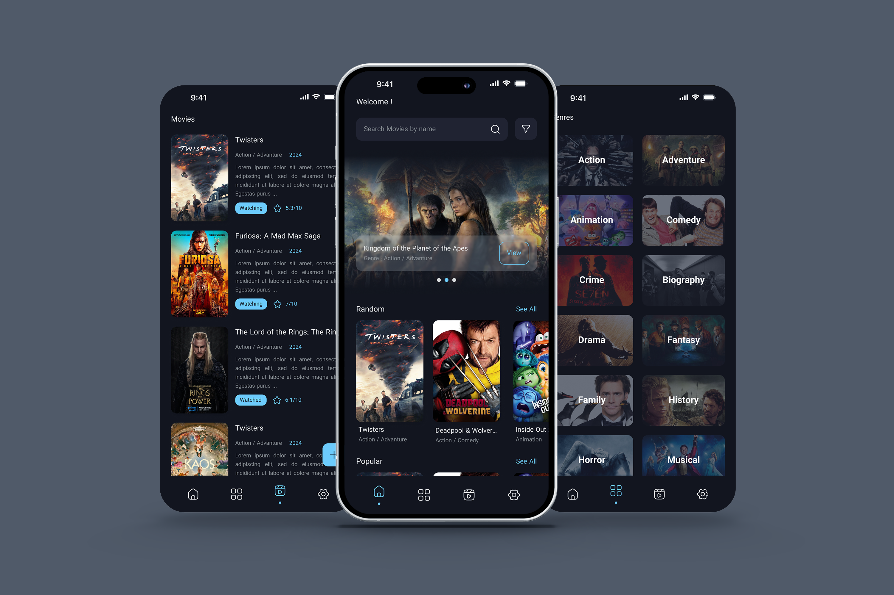

# 🎬 FilmHive – Movie & TV Series Archive  

Welcome to **FilmHive**! 🍿🎥 A modern and feature-rich application designed to help you explore, search, and manage your favorite movies and TV series effortlessly. 🚀  

---

## 🔥 Features  

✅ **Advanced Search** 🎯 – Find movies and TV shows quickly with powerful filtering options.  
✅ **Movie & TV Show Details** 📄 – Get comprehensive details, including cast, synopsis, and ratings.  
✅ **Favorites & Watchlist** ❤️ – Save your favorite content for later viewing.  
✅ **Offline Support** 📶 – Browse your saved movies even without an internet connection.  
✅ **Dark Mode** 🌙 – Enjoy a sleek and modern dark theme for better user experience.  

---

## 🛠 Tech Stack  

- **Flutter** – Cross-platform mobile development  
- **BLoC (Business Logic Component)** – State management  
- **Repository Pattern** – Clean and scalable architecture  
- **Datasource Layer** – Efficient data handling  
- **SQLite** – Local database for offline storage  

---

## 📸 Screenshots

🔥 Enjoy FilmHive and never miss a great movie again! 🎥🚀